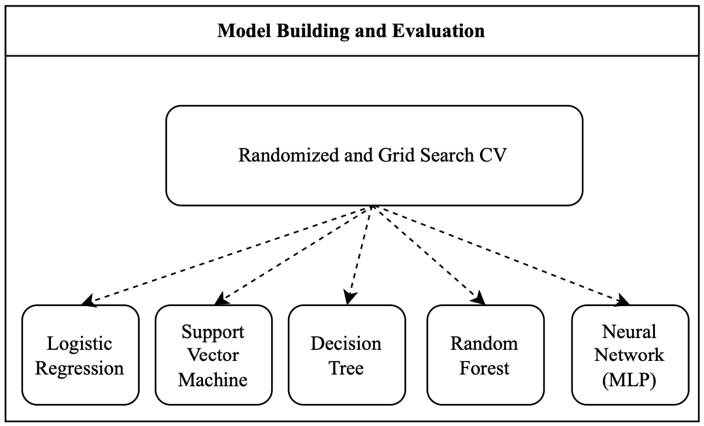

# CSML-Product-Mapping-Dataset


## 1. Objective
Replicate methods and technologies outlined in the paper to achieve end-to-end results for the ProMapEn dataset.


## 2. Preparation

#### 2.1 Paracrawl Data Process
* Download the [paracrawl](https://web-language-models.s3.us-east-1.amazonaws.com/paracrawl/release9/en-cs/en-cs.txt.gz) dataset (3.9GB zip file)
* Unzip the file and place the `en-cs.txt` (9.01GB) in the `datasets` folder
* Create the english vocabulary by running [paracrawl.py](Paracrawl.py)
* Vocab file is created as [english_words.txt](features/english_words.txt) in the `features` folder

#### 2.2 Image Scraping
* Run [Scraping.ipynb](Scraping.ipynb) to download the images in real time
* Alternatively, download the `ProMapEn` folder from [link](https://drive.google.com/drive/folders/1hfqp-LqDahBHWRcAtenxlIlQf0K3yzJH) and place it in the `images` folder


## 3. Final Directory Structure
Before beginning with feature engineering, cross verify the folder and file placement as per below directory tree

```
├── Evaluation.ipynb
├── Feature-Engineering-Part-1.ipynb
├── Feature-Engineering-Part-2.ipynb
├── Model-Building-Grid-and-Random-Search-CV.ipynb
├── README.md
├── Scraping.ipynb
├── datasets
│   ├── ProMapCz
│   │   ├── promapcz-test_data_similarities.csv
│   │   └── promapcz-train_data_similarities.csv
│   ├── ProMapEn
│   │   ├── promapen-test_data.csv
│   │   ├── promapen-test_data_similarities.csv
│   │   ├── promapen-train_data.csv
│   │   └── promapen-train_data_similarities.csv
│   ├── README.md
│   ├── amazon-google
│   │   ├── amazon_google-test_data_similarities.csv
│   │   └── amazon_google-train_data_similarities.csv
│   ├── amazon-walmart
│   │   ├── amazon_walmart-test_data_similarities.csv
│   │   └── amazon_walmart-train_data_similarities.csv
│   └── en-cs.txt
├── features
│   ├── ProMapEn
│   │   ├── images_test_similarties.csv
│   │   ├── images_train_similarties.csv
│   │   ├── promapen_test_similarities.csv
│   │   └── promapen_train_similarities.csv
│   └── english_words.txt
├── images
│   ├── ProMapEn
│   │   ├── test
│   │   └── train
│   └── readme_imgs
├── paracrawl.py
└── results
    ├── ProMapEn
    │   └── result-10-models.csv
    └── all-test-data.csv
```


## 4. Feature Engineering

#### 4.1 Image Processing
* [Feature-Engineering-Part-1.ipynb](Feature-Engineering-Part-1.ipynb)
  * Loads the images from the `images/ProMapEn`
  * Preprocesses the images
  * Calculate the perceptual hash (64 bits) of the image 
  * Hash similarity between two images is calculated using hamming distance with threshold of 0.9
  * Generates `1` feature and results are stored as `images_test_similarties.csv` and `images_train_similarties.csv` in the `features/ProMapEn/` folder


* [Feature-Engineering-Part-2.ipynb](Feature-Engineering-Part-2.ipynb)
  * Loads the data from the `datasets/ProMapEn`
  * Preprocesses the textual content
  * Calculate text similarity using cosine and jaccardian 
  * Generates 33 features by extracting information from various keywords

* Final Features
  * Features: 34
  * Labels: Matching or Non-Matching 
  * All the features are stored in `promapen_test_similarities.csv` and `promapen_train_similarities.csv` in the `features/ProMapEn/` folder


## 5. Model Building and Selection
* [Model-Building-Grid-and-Random-Search-CV.ipynb](Model-Building-Grid-and-Random-Search-CV.ipynb): Python code
* Utilized both grid search and random search techniques, with 20% validation set, to identify optimal hyperparameters
* Conducted hyperparameter tuning for linear regression, support vector machines, decision trees, random forests and neural network models.
* Model selection was based on maximizing the F1 score
* Best results were obtained by neural network-based models followed by logistic regression and random forests
* Neural networks have the most balanced precision and recall, while the random forests have larger differences



## 6. Model Evaluation
* [Evaluation.ipynb](Evaluation.ipynb): Python code
* Transfer learning capabilities were tested by selecting the optimal model of ProMapEn and evaluating it on all other datasets

| Test Dataset   |  F1 Score  | Precision |      Recall |  
|----------------|:----------:|----------:|------------:|
| ProMapEn       |   0.6593   |    0.7407 |      0.5941 |
| ProMapCz       |   0.5836   |    0.4717 |      0.7653 |
| Amazon Walmart |   0.5350   |    0.9767 |      0.3684 |
| Amazon Google  |   0.5604   |    1.0000 |      0.3893 |

## 7. Credits
* Thank you, Prof Dani Yogatama, TAs, CPs for guidance and feedback
* [kackamac](https://github.com/kackamac/Product-Mapping-Datasets) Thanks for the wonderful dataset
* Kateřina Macková, Martin Pilát for wonderful paper [Link](https://arxiv.org/pdf/2309.06882.pdf)